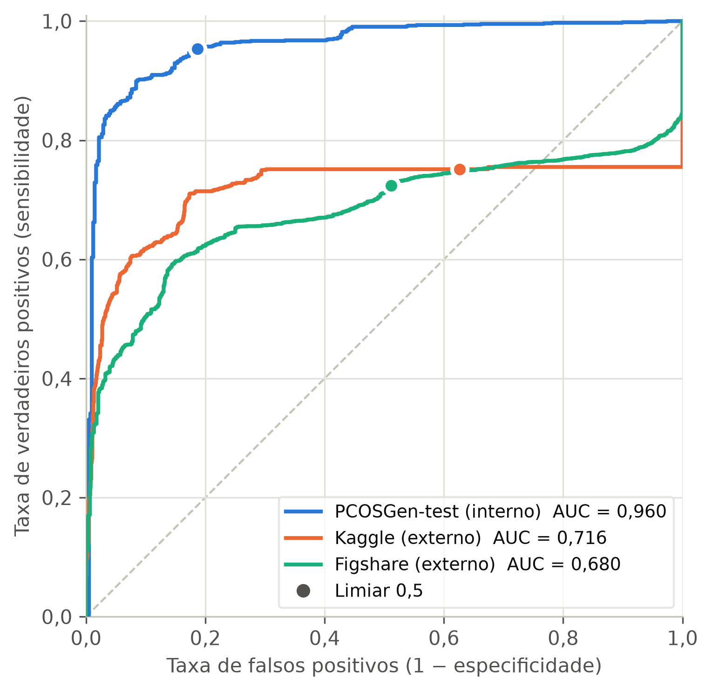
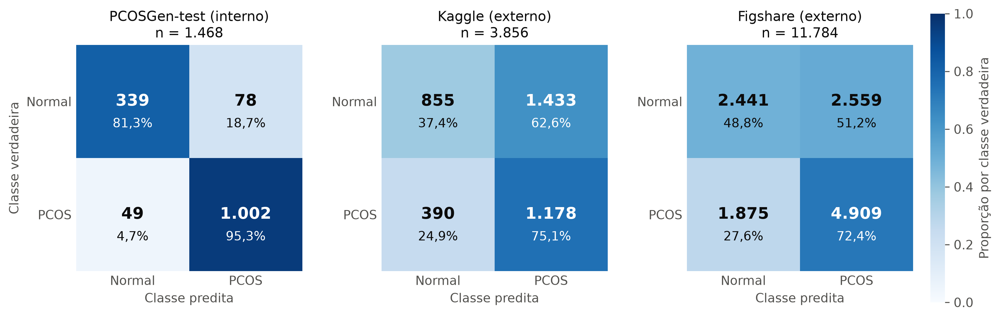
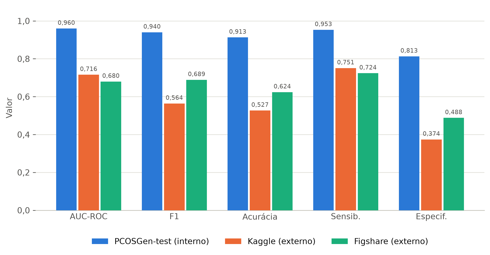

# Generalização de uma ResNet-50 na detecção de SOP em ultrassom

Código e resultados do artigo apresentado no ERAMIA-RS 2026. Uma ResNet-50
pré-treinada no ImageNet é ajustada para classificar imagens de ultrassom
ovariano como normais ou com síndrome dos ovários policísticos (SOP/PCOS). O
treino usa somente o PCOSGen-train. O modelo é avaliado no PCOSGen-test (teste
interno) e em duas bases externas (Kaggle e Figshare), para medir a perda de
desempenho fora da distribuição de treino.

## Bases de dados

| Base | Uso | Imagens | Normais | PCOS | Link |
|---|---|---|---|---|---|
| PCOSGen-train | treino/validação | 3.200 | 903 | 2.297 | https://doi.org/10.5281/zenodo.14592001 |
| PCOSGen-test | teste interno | 1.468 | 417 | 1.051 | https://doi.org/10.5281/zenodo.14591782 |
| Kaggle | teste externo | 3.856 | 2.288 | 1.568 | https://www.kaggle.com/datasets/anaghachoudhari/pcos-detection-using-ultrasound-images |
| Figshare | teste externo | 11.784 | 5.000 | 6.784 | https://doi.org/10.6084/m9.figshare.27682557 |

No Kaggle, `src/evaluate.py` junta as pastas `train/` e `test/` da base e avalia
o modelo nas duas.

## Resultados

Limiar de decisão: 0,5 sobre a saída sigmoide. Classe positiva: PCOS.

| Conjunto | AUC-ROC | F1 | Acurácia | Sensib. | Especif. |
|---|---|---|---|---|---|
| PCOSGen-test (interno) | 0,960 | 0,940 | 0,913 | 0,953 | 0,813 |
| Kaggle (externo) | 0,716 | 0,564 | 0,527 | 0,751 | 0,374 |
| Figshare (externo) | 0,680 | 0,689 | 0,624 | 0,724 | 0,488 |

Matrizes de confusão (contagens absolutas, verdadeiro→predito):

| Conjunto | Normal→Normal | Normal→PCOS | PCOS→Normal | PCOS→PCOS |
|---|---|---|---|---|
| PCOSGen-test (interno) | 339 | 78 | 49 | 1002 |
| Kaggle (externo) | 855 | 1433 | 390 | 1178 |
| Figshare (externo) | 2441 | 2559 | 1875 | 4909 |

A saída original de `src/evaluate.py` com esses valores está em
[`outputs/logs/evaluation_results.csv`](outputs/logs/evaluation_results.csv). O
log por época do treino está em [`outputs/logs/train_log.csv`](outputs/logs/train_log.csv).







O score de cada imagem nos três conjuntos de teste está em
[`outputs/scores/`](outputs/scores/), com as colunas `image`, `label` (0 =
normal, 1 = PCOS), `logit` e `prob_pcos`. As curvas ROC são calculadas a partir
desses arquivos. No gráfico, o ponto em cada curva marca o limiar 0,5.

Nenhum dos scripts de figura precisa dos dados ou do modelo:

```
python resultados/gerar_roc.py       # curvas_roc.png, a partir de outputs/scores/
python resultados/gerar_figuras.py   # matrizes e barras, a partir das tabelas acima
```

`gerar_roc.py` confere se a AUC calculada a partir dos scores bate com a tabela.
`gerar_figuras.py` confere se F1, acurácia, sensibilidade e especificidade batem
com as matrizes de confusão.

## Qualidade dos dados: duplicatas e sobreposição entre bases

Esta análise não faz parte do artigo. O script
[`src/verificar_duplicatas.py`](src/verificar_duplicatas.py) compara o MD5 dos
arquivos, então só encontra cópias exatas, não imagens parecidas. Ele recalcula
as métricas a partir dos scores salvos, sem precisar do modelo. Os grupos de
arquivos idênticos estão em
[`outputs/logs/duplicatas_grupos.csv`](outputs/logs/duplicatas_grupos.csv) e as
métricas em
[`outputs/logs/metricas_sem_duplicatas.csv`](outputs/logs/metricas_sem_duplicatas.csv).

O que a verificação encontrou:

- **Kaggle:** as pastas `train/` e `test/` da base são praticamente cópias uma da
  outra. Dos 3.856 arquivos, 1.922 são únicos. Dez deles são arquivos vazios
  (0 bytes), alguns em `infected/` e outros em `notinfected/`. O `evaluate.py`
  troca esses arquivos por uma imagem preta.
- **Figshare:** dos 11.784 arquivos, 3.996 são únicos. Desses, 2.254 (todos
  rotulados como PCOS na Figshare) são idênticos a imagens do PCOSGen-train.
- **Kaggle × Figshare:** as duas bases têm 1.024 imagens idênticas em comum, com
  o mesmo rótulo nas duas.
- **PCOSGen-test:** 19 pares de arquivos idênticos, um deles com rótulos
  diferentes. O arquivo de rótulos repete 2 linhas. Nenhuma imagem é idêntica a
  uma do PCOSGen-train.
- **PCOSGen-train:** 28 das 640 imagens de validação são idênticas a imagens de
  treino.

Métricas recalculadas. Grupos de arquivos idênticos com rótulos diferentes
foram descartados.

| Conjunto | Versão | n | Normais | PCOS | AUC-ROC | F1 | Acurácia | Sensib. | Especif. |
|---|---|---|---|---|---|---|---|---|---|
| PCOSGen-test | original | 1.468 | 417 | 1.051 | 0,960 | 0,940 | 0,913 | 0,953 | 0,813 |
| PCOSGen-test | sem duplicatas | 1.446 | 411 | 1.035 | 0,960 | 0,940 | 0,914 | 0,953 | 0,815 |
| Kaggle | original | 3.856 | 2.288 | 1.568 | 0,716 | 0,564 | 0,527 | 0,751 | 0,374 |
| Kaggle | sem duplicatas | 1.921 | 1.142 | 779 | 0,717 | 0,564 | 0,527 | 0,754 | 0,373 |
| Figshare | original | 11.784 | 5.000 | 6.784 | 0,680 | 0,689 | 0,624 | 0,724 | 0,488 |
| Figshare | sem duplicatas | 3.996 | 812 | 3.184 | 0,655 | 0,762 | 0,656 | 0,691 | 0,517 |
| Figshare | sem duplicatas e sem imagens do PCOSGen-train | 1.742 | 812 | 930 | 0,724 | 0,701 | 0,650 | 0,767 | 0,517 |

Remover as imagens do PCOSGen-train não muda o PCOSGen-test nem o Kaggle, porque
nenhum dos dois tem cópia exata delas.

## Estrutura

```
src/
  dataset.py             leitura dos rótulos do PCOSGen-train e divisão treino/validação
  transforms_config.py   pré-processamento (224x224, normalização ImageNet) e augmentation
  model.py               ResNet-50 (ImageNet) com Dropout(0,5) + Linear(1)
  train.py               treino no PCOSGen-train
  evaluate.py            avaliação no PCOSGen-test, Kaggle e Figshare
  exportar_splits.py     salva em CSV a partição treino/validação
  verificar_duplicatas.py  duplicatas, sobreposição entre bases e métricas sem duplicatas
  01_explore_dataset.py  análise exploratória do Figshare
  02_explore_kaggle.py   análise exploratória do Kaggle
  03_explore_pcosgen.py  análise exploratória do PCOSGen
  contar_classes.py      contagem de imagens por classe em cada base
  montar_figura_amostras.py  figura com amostras de imagens
outputs/logs/            logs de treino, resultados da avaliação e análise de duplicatas
outputs/scores/          score de cada imagem nos três conjuntos de teste
resultados/              figuras de resultados e os scripts que as geram
resultados/splits/       partição treino/validação do PCOSGen-train
```

## Reprodução

### Ambiente

Os resultados foram obtidos com Python 3.11.9 e as versões listadas em
[`requirements.txt`](requirements.txt). O torch usado foi o build com CUDA 12.8.
Para instalar a versão com GPU, siga as instruções em https://pytorch.org.

```
pip install -r requirements.txt
```

### Dados

Os scripts usam caminhos absolutos começando em `G:/tcc/`, definidos no topo de
cada arquivo. Para rodar em outra máquina, ajuste essas constantes
(`LABELS_PATH`, `IMG_DIR`, `OUTPUT_DIR` em `train.py`; `MODEL_PATH`,
`RESULTS_PATH`, `SCORES_DIR`, `PCOSGEN_TEST_*`, `KAGGLE_DIR`, `FIGSHARE_DIR` em
`evaluate.py`, e as constantes equivalentes no topo de `exportar_splits.py` e
`verificar_duplicatas.py`).
A estrutura esperada, relativa a essa raiz, é:

```
data/pcosgen/train/PCOSGen-train/PCOSGen-train/images/
data/pcosgen/train/PCOSGen-train/PCOSGen-train/class_label.xlsx
data/pcosgen/test/PCOSGen-test/images/
data/pcosgen/test/class label.csv
data/kaggle/data/{train,test}/{infected,notinfected}/
data/figshare/PCOS/{infected,noninfected}/
```

No PCOSGen o rótulo vem da coluna `Healthy` (1 = normal, 0 = PCOS). O código
inverte essa coluna para seguir a convenção do projeto: 0 = normal, 1 = PCOS.

### Partição treino/validação

`train.py` gera a partição a cada execução com `split_train_val` em
`src/dataset.py`, que chama o `train_test_split` do scikit-learn com 20% para
validação, estratificação pelo rótulo e `random_state=42`. A partição usada está
salva em [`resultados/splits/`](resultados/splits/): treino com 2.560 imagens
(722 normais, 1.838 PCOS) e validação com 640 (181 normais, 459
PCOS). Para gerar esses arquivos de novo:

```
python src/exportar_splits.py
```

O PCOSGen-test, o Kaggle e o Figshare entram inteiros na avaliação. A lista de
imagens de cada um está nos arquivos de [`outputs/scores/`](outputs/scores/).

### Treino

```
python src/train.py
```

O treino dura até 50 épocas e usa batch 32, Adam (lr 1e-4, weight decay 1e-3),
`BCEWithLogitsLoss` com `pos_weight` calculado pelo balanceamento de classes e
`ReduceLROnPlateau` monitorando a AUC de validação. A augmentation tem flip
horizontal e rotação de até 10°. O treino para depois de 15 épocas sem melhora
da AUC de validação. O melhor modelo, escolhido pela AUC de validação, é salvo
em `outputs/models/best_model.pt` e o log em `outputs/logs/train_log.csv`. Os
pesos treinados não fazem parte deste repositório.

### Avaliação

```
python src/evaluate.py
```

Carrega `outputs/models/best_model.pt`, avalia o modelo nos três conjuntos de
teste e imprime métricas e matrizes de confusão. Grava
`outputs/logs/evaluation_results.csv` e o score de cada imagem em
`outputs/scores/`. O script usa `NUM_WORKERS = 4`. Se faltar memória, reduza
esse valor: os resultados não mudam (com 0 workers, conferimos que métricas e
matrizes saem idênticas).

Depois da avaliação:

```
python src/verificar_duplicatas.py
python resultados/gerar_roc.py
```
